# AGLIAM BIM ROCHEE

<div align="center">

<!-- Animated Header with Gradient -->


<!-- Animated Typing Effect -->
[](https://git.io/typing-svg)

<!-- Social Badges with Hover Effects -->
<p>
<a href="mailto:bemzagliam14@gmail.com">

</a>
<a href="tel:+639103679602">

</a>
<a href="https://github.com/BimRochee">

</a>
</p>

<!-- Animated Divider -->


</div>

## 🎯 **PROFESSIONAL SUMMARY**

<div align="center">

interface Developer {
  readonly identity: PersonalInfo;
  readonly expertise: TechnicalSkills;
  readonly achievements: Recognition[];
  readonly vision: string;
}

class AgliamBimRochee implements Developer {
  readonly identity = {
    name: "Agliam Bim Rochee" as const,
    title: "Full-Stack Developer & IT Security Specialist",
    location: "🇵🇭 Davao de Oro, Philippines",
    status: "🎓 Graduating Cum Laude | Class of 2025"
  };

  readonly expertise = {
    frontend: ["HTML5", "CSS3", "JavaScript"] as const,
    backend: ["PHP", "Laravel", "Java"] as const,
    mobile: ["Flutter", "Dart"] as const,
    database: ["Firebase", "Supabase"] as const,
    specialization: "Information Security & System Architecture"
  };

  readonly achievements = [
    "🏆 Best Poster Award - CDITE XI PakiglambigIT 2025",
    "🎓 Cum Laude Graduate - University of Southeastern Philippines",
    "💼 DOST-PCAARRD Research Intern - Cacao Traceability System",
    "🚀 Award-Winning Capstone - TraKs Tourism Management Platform"
  ];

  readonly vision = `
    🎯 Mission: Bridging innovation with practical solutions
    💡 Philosophy: User-centered design meets robust architecture
    🌟 Goal: Advancing technology for societal impact
  `;

  // Current focus and availability
  getCurrentProjects(): string[] {
    return [
      "🍫 Cacao Supply Chain Innovation (DOST-PCAARRD)",
      "🏖️ Tourism Management System (Capstone Research)",
      "🔒 Advanced Security Implementation Studies"
    ];
  }

  getAvailableFor(): string[] {
    return [
      "💼 Full-Stack Development Opportunities",
      "🔬 Research Collaborations",
      "🤝 Open Source Contributions",
      "📚 Knowledge Sharing & Mentorship"
    ];
  }
}

// Initialize developer instance
const developer = new AgliamBimRochee();
console.log("🚀 Ready to innovate and collaborate!");

</div>

<div align="center">

</div>

---

## 🏆 **ACADEMIC EXCELLENCE**

<div align="center">
<table>
<tr>
<td width="50%" align="center">

### 🎓 **ACADEMIC ACHIEVEMENT**
```yaml
Degree: Bachelor of Science in IT
Major: Information Security
Institution: University of Southeastern Philippines
Status: Graduated June 2025
Honor: 🏆 CUM LAUDE
```

</td>
<td width="50%" align="center">

### 🌟 **RECOGNITION**
```yaml
Award: 🏆 Best Poster Award
Event: CDITE XI PakiglambigIT 2025
Category: IT Education Forum & Research
Focus: Tourism Management Innovation
```

</td>
</tr>
</table>
</div>

---

## 💻 **TECH STACK MASTERY**

<div align="center">

### 🎨 **Frontend Arsenal**
<p>

</p>

### ⚙️ **Backend Powerhouse**
<p>

</p>

### 📱 **Mobile Innovation**
<p>

</p>

### 🗄️ **Database & Cloud**
<p>

</p>

### 🛠️ **Development Tools**
<p>

</p>

</div>

---

## 🚀 **FEATURED PROJECTS**

<div align="center">
<table>
<tr>
<td width="50%">

### 🍫 **Cacao Traceability System**
*Professional Internship • USeP R&D Office*

```mermaid
graph TD
    A[🌱 Cacao Farm] --> B[📱 Flutter App]
    B --> C[🔥 Firebase Backend]
    C --> D[📊 Analytics Dashboard]
    D --> E[🎯 Supply Chain Optimization]
    
    style A fill:#2ECC71
    style B fill:#3498DB
    style C fill:#E74C3C
    style D fill:#F39C12
    style E fill:#9B59B6
```



**Impact:** Enhanced agricultural transparency & efficiency

</td>
<td width="50%">

### 🏖️ **TraKs Tourism System**
*🏆 Award-Winning Capstone Project*

```mermaid
graph LR
    A[👥 Tourists] --> B[📱 Mobile App]
    B --> C[🌐 Web Platform]
    C --> D[🏛️ LGU Dashboard]
    D --> E[📈 Real-time Analytics]
    
    style A fill:#FF6B35
    style B fill:#4ECDC4
    style C fill:#45B7D1
    style D fill:#96CEB4
    style E fill:#FFEAA7
```



**Achievement:** Best Poster Award Winner 2025

</td>
</tr>
</table>
</div>

---

## 📊 **PERFORMANCE METRICS**

<div align="center">
<table>
<tr>
<td width="50%">

### 🎯 **Skill Proficiency Matrix**
```
Advanced         ████████████████████ 100%  System Design
                 ████████████████████ 100%  HTML5/CSS3
                 
Proficient       ████████████████░░░░  80%  JavaScript/Laravel
                 ████████████████░░░░  80%  Flutter Development
                 
Intermediate     ████████████░░░░░░░░  60%  Cloud Integration
                 ████████████░░░░░░░░  60%  Mobile Architecture
                 
Developing       ████████░░░░░░░░░░░░  40%  DevOps/CI-CD
                 ████████░░░░░░░░░░░░  40%  Advanced Backend
```

</td>
<td width="50%">

### 📈 **GitHub Analytics**


</td>
</tr>
</table>
</div>

---

## 🌟 **PROJECT SHOWCASE**

<div align="center">

### 📱 **Mobile Development Journey**


### 🏗️ **Architecture Philosophy**
```ascii
    ╔═══════════════════════════════════════════════════════════════════╗
    ║                        🎯 DEVELOPMENT MINDSET                    ║
    ╠═══════════════════════════════════════════════════════════════════╣
    ║  🎨 User-Centered Design  │  🔒 Security-First Approach         ║
    ║  ⚡ Performance Optimized  │  🧩 Modular Architecture           ║
    ║  📱 Cross-Platform Ready  │  🔄 Agile Development Process      ║
    ║  🌐 Scalable Solutions    │  💡 Innovation-Driven Thinking     ║
    ╚═══════════════════════════════════════════════════════════════════╝
```

</div>

---

## 🎨 **PROFESSIONAL PHILOSOPHY**

<div align="center">

> ### *"Excellence in technology is achieved through the harmonious integration of*
> ### *innovative design, robust architecture, and unwavering commitment*
> ### *to user-centered development."*


**🎯 Mission Statement**
*Dedicated to advancing information technology through continuous learning,*  
*innovative problem-solving, and creating impactful digital solutions that serve*  
*both individual users and broader societal needs.*

</div>

---

## 📞 **LET'S COLLABORATE**

<div align="center">

### 🤝 **Open for Professional Opportunities**

<table>
<tr>
<td align="center" width="33%">

### 💼 **Career Opportunities**
🚀 Full-Stack Development  
📱 Mobile App Projects  
🔒 Security Consulting  

</td>
<td align="center" width="33%">

### 🔬 **Research Collaboration**
📊 Academic Partnerships  
💡 Innovation Projects  
🏆 Competition Teams  

</td>
<td align="center" width="33%">

### 🌐 **Open Source**
🔧 Community Projects  
📚 Knowledge Sharing  
🤝 Mentorship Programs  

</td>
</tr>
</table>

<!-- Contact Animation -->


<!-- Professional Badge -->
<p>


</p>

</div>

---

<div align="center">

<!-- Footer with Animated Wave -->


### 🌟 **Thank you for visiting!** 🌟
*Let's build the future of technology together*

**© 2025 Agliam Bim Rochee** • *Davao de Oro, Philippines* 🇵🇭

</div>
